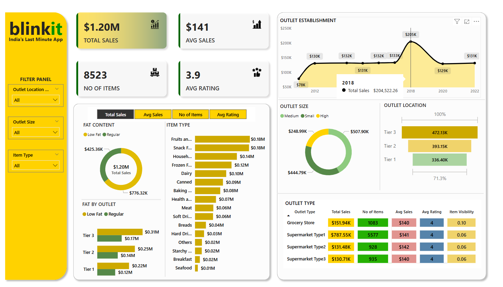

# Blinkit Data Analysis Dashboard

## Project Overview

This Power BI dashboard offers a detailed look at Blinkit’s operations by visualizing sales trends, customer feedback, and inventory distribution. Designed for business analysts and decision‑makers, it highlights key metrics and provides interactive elements to explore data at various levels.

## Data Source

* **Dataset File:** `BlinkIT Grocery Data.xlsx` (Excel)
* **Contents:** Records of item sales, ratings, outlet attributes (location tier, size, type), and timestamps
* **Import Method:** Loaded using Power Query in Power BI Desktop

## Data Preparation & Transformation

1. **Standardize Categorical Values:**

   * Converted variations of fat content (`lf`, `low fat`) to `Low Fat`
   * Unified `reg` entries to `Regular`
2. **Rename & Format Columns:**

   * Ensured clear, descriptive column names (e.g., `Outlet_Type`, `Item_Weight`)
   * Set appropriate data types (numeric, text, date)
     
3. **Calculated Measures:**

   * **Total Sales** = SUM(SalesAmount)
   * **Average Sales** = DIVIDE(\[Total Sales], \[No\_of\_Items])
   * **Average Rating** = AVERAGE(Rating)

## Key Performance Indicators (KPIs)

* **Total Sales:** Total revenue from all transactions
* **Average Sales:** Mean value per sale
* **Number of Items:** Distinct count of SKUs sold
* **Average Rating:** Customer satisfaction metric on a 1–5 scale

## Dashboard Features

* **Interactive Filters:** Slice data by outlet location tier, outlet size, and item category
* **Trend Analysis:** Line chart showing outlet count growth over time
* **Category Breakdown:** Donut charts for fat content and outlet size distribution
* **Performance Comparison:** Bar and column visuals comparing outlets by type and location tier
* **Detailed Tables:** Tabular views with search and sorting for deeper inspection

## Dashboard Screenshot

## Insights & Conclusions

* Sales have steadily increased, indicating market expansion and customer retention
* Low Fat products outperform Regular in total revenue, aligning with health trends
* Fruits, snacks, and packaged foods are the most popular categories by volume and revenue
* Tier 3 medium‑sized outlets exhibit the highest average sales per transaction
* Supermarkets lead in overall sales, while grocery stores have superior item diversity
